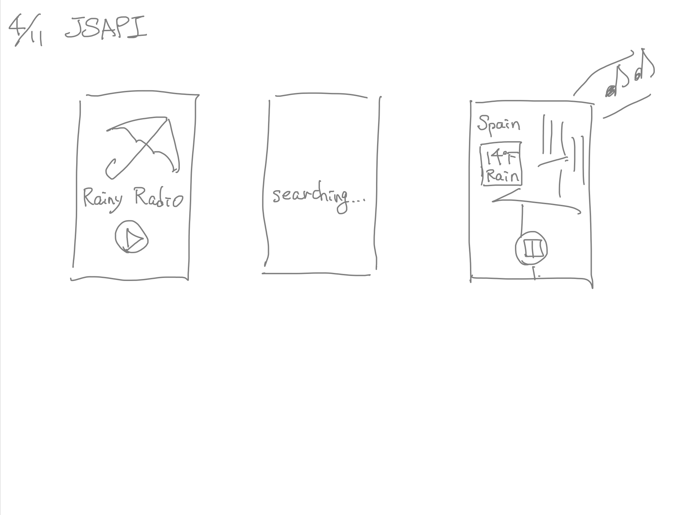

#Final Proposal
## idea 1 Self DJ/VJ Music Performance App
### Concept & Specification
- Sound x Visual

### Technologies I will use
- React native
- node.js
- Web Audio API
- Unsplash API
- OpenWeatherMap API
- p5.js

### Precedents
- http://mach3.github.io/tonegrid.js/
- https://webx0x.com/beats/new#
- http://mach3.github.io/oscy.js/

## idea 2 Raining Radio
### Concept & Specification
- Poetic
- Play with world
- We can hear the radio where it is raining now
- We can imagine the faraway country

### Technologies I will use
- React native
- node.js
- Web Audio API?
- Unsplash API
- OpenWeatherMap API
- p5.js

### Problem
- I couldn't find an easy-to-use radio API
